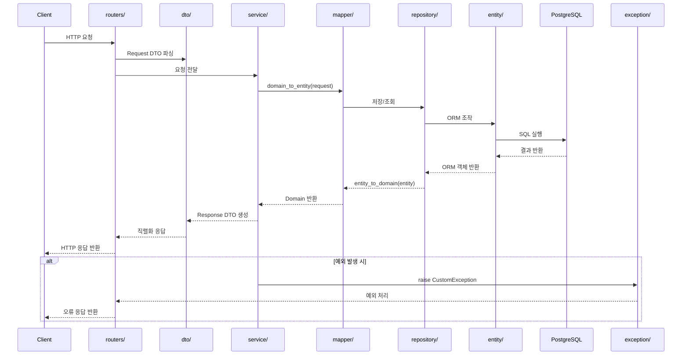
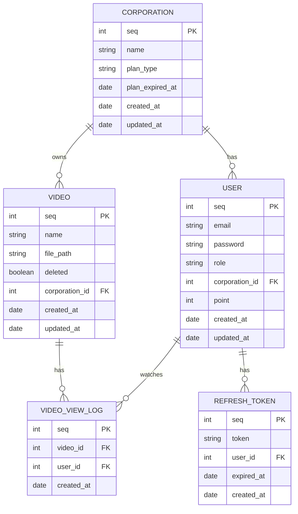
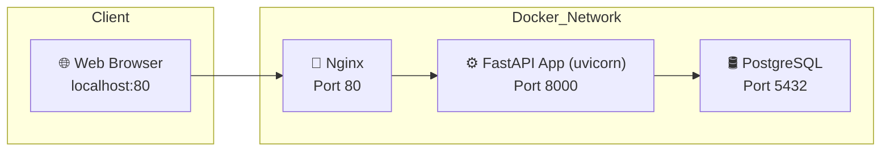

# 🚀 Video Management Server

이 프로젝트는 **FastAPI**, **SQLAlchemy**, **PostgreSQL** 기반의 **비동기 동영상 관리 서버**입니다.  
기업/회원/영상 CRUD, 인증, 스트리밍, 포인트 지급, Soft Delete, 유료 복구 기능 등을 포함하고 있습니다.

### 🔄 기능 체크리스트

| 기능 | 구현 여부 |
| --- | --- |
| 기업/회원/영상 CRUD | ✅ |
| 유료/무료 플랜 및 기한 관리 | ✅ |
| soft delete 및 복구 | ✅ |
| JWT 로그인(access + refresh) | ✅ |
| 포인트 지금 (영상 조회 시) | ✅ |
| 유료 플랜 기한 만료 시 자동 전환 | ✅ |
| Swagger 문서 | ✅ /docs |
| docker-compose | ✅ |
| Alembic 또는 SQL Schema 파일 | ✅ |
| .http 테스트 제공 | ✅ |


프로젝트와 관련된 추가적인 정보는 아래 문서에서 확인하실 수 있습니다:  
- [API 문서](README_API_DESC.md): API 사용법 및 엔드포인트에 대한 설명을 제공합니다.
- [테스트 문서](README_TEST.md): 테스트 케이스 및 테스트 방법을 다룹니다.

---

## ✅ 프로젝트 개요

- 기업, 회원, 영상 리소스를 비동기 API로 관리
- JWT 기반 인증 시스템 (access/refresh token)
- 영상 스트리밍 요청 시 회원에게 포인트 지금
- 유료 플랜 기업만 soft delete 된 영상 복구 가능
- Docker + Alembic 기반 인프라 및 마이그리션
- REST Client 기반 HTTP 테스트 스크립트 제공
- APScheduler를 이용해 유료 플랜 기한 초과 여부를 주기적으로 체크하여, 자동으로 무료 플랜으로 전환

---

## 🔐 접속 주소

- Base
    - [http://localhost](http://localhost/docs)
- Swagger
    - http://localhost/docs

---

## 🧱 기술 스택

| 항목 | 내용 |
| --- | --- |
| 언어 | Python 3.11 |
| 웹 프레임워크 | FastAPI (async) |
| ORM | SQLAlchemy (Async ORM) |
| DB | PostgreSQL 15 (Docker 기반) |
| 인증 | OAuth2PasswordBearer + JWT |
| Infra | Docker Compose |
| Migration | Alembic |
| 테스트 | `.http` (REST Client) |

---

## 📂 프로젝트 폴더 구조

```
📆 fastapi-lumanlab/
├── 🗂️ alembic/                              # DB 마이그레이션 (alembic revision 및 env.py)
│   ├── 📝 env.py
│   └── 📜 versions/
│       └── 🧾 de519d8b11a1_init_schema.py   # alembic 초기 DB 스키마 생성 리비전 파일
├── 🗂️ docker/                               # Docker 실행 스크립트
│   ├── 🖥️ start.sh                          # 컨테이너 실행용 셸 스크립트
├── 🗂️ nginx/                                # Nginx 설정
│   ├── ⚙️ nginx.conf                        # Nginx 설정 파일
├── 🗂️ rest_client/                          # REST Client 테스트 스크립트
│   ├── 📄 auth_test.http
│   ├── 📄 corporations_test.http
│   ├── 📄 tokens_test.http
│   ├── 📄 users_test.http
│   ├── 📄 videos_test.http
│   └── 📄 view_logs_test.http
├── 🗂️ src/                      # FastAPI 애플리케이션 소스
│   ├── ⚙️ config/               # 의존성 주입 config 구성
│   ├── 🧠 core/                 # 앱 팩토리, DB 설정, 환경 설정 등
│   ├── 🧩 domain/               # 도메인 객체 (DB 의존성 없는 순수 객체)
│   ├── 📨 dto/                  # 요청(Request) / 응답(Response) DTO
│   ├── 🏗️ entity/               # SQLAlchemy 모델
│   ├── 🏷️ enums/                # Enum 정의 (회원/기업 등)
│   ├── 📦 env/                  # .env.dev 환경파일(DB 접속정보, JWT 설정)
│   ├── 🚨 exception/            # 공통 예외 및 핸들러
│   ├── 🔁 mapper/               # ORM 모델 <-> 도메인 엔티티 변환
│   ├── 📂 repository/           # DB 접근 계층
│   ├── 🌐 routers/              # FastAPI 라우터 (API 엔드포인트)
│   ├── 🧩 service/              # 비즈니스 로직 계층
│   ├── 🧪 tests/                # 단순 테스트 코드
│   └── 🛠️ utils/                # JWT, 암호화 유틸
├── ⚙️ alembic.ini               # Alembic 마이그레이션 설정 파일
├── 🐘 docker-compose.yml        # PostgreSQL 인프라 구성
├── 🐳 Dockerfile                # 애플리케이션용 Docker 빌드 설정
├── 🧾 init_schema.sql           # DB 수동 초기화 SQL
├── 🚀 main.py                   # FastAPI 앱 실행 진입점
├── 📘 README.md                 # 프로젝트 전체 개요 및 설명서
├── 📙 README_API_DESC.md        # API 명세 및 설명 문서
├── 📗 README_TEST.md            # REST API 테스트 설명서
└── 📦 requirements.txt          # Python 의존성 정의
```

---

## 📂 프로젝트 아키텍처 ERD (Mermaid)

FastAPI 기반 프로젝트의 패키지 계층 구조에 따라
HTTP 요청이 처리되는 전체 흐름을 시퀀스 형태로 시각화한 것입니다.
각 패키지는 실제 디렉토리(src/)에 존재하는 모듈로, 책임과 데이터 흐름에 따라 연결됩니다.



---

## 📂 ERD 아키텍처 (Mermaid)

▶ **Corporation**: 기업 정보 / 유료 여부 / 기한 관리  
▶ **User**: admin or guest / 기업 / 포인트  
▶ **Video**: 영상 메타정보 / 삭제 여부  
▶ **VideoViewLog**: 회원의 영상 시청 로그  
▶ **RefreshToken**: 리프레시 토큰 관리  



## 🗺️ 서비스 아키텍처 (Mermaid)



---

## 🚀 실행 방법

### ✅ 전체 컨테이너 실행 및 종료 (FastAPI + Nginx + PostgreSQL)

```bash
docker-compose up -d
docker-compose down
```

- `backend`: FastAPI 앱 (uvicorn 실행)
- `postgres`: PostgreSQL 15
- `nginx`: FastAPI → Nginx 프록시 구성 (80포트 노출)

```python
[+] Running 4/4
 ✔ Network fastapi-lumanlab_default  Created  0.0s 
 ✔ Container fastapi-postgres  Created  0.1s 
 ✔ Container fastapi-backend   Created  0.1s 
 ✔ Container fastapi-nginx     Created  0.1s     
```

---

## ✅ 옵션

- Alembic 마이그레이션
    
    ```bash
    docker exec -it fastapi-backend alembic upgrade head
    ```
    
- SQL 스크립트 수동 실행
    
    ```bash
    docker exec -it fastapi-postgres bash
    psql -U postgres -d lumanlab_db -f init_schema.sql
    ```
    
- 의존성 설치
    
    ```bash
    python3 -m venv venv
    source venv/bin/activate
    pip install -r requirements.txt
    ```
    
- Uvicorn 실행
    - 프로젝트 루트 디렉토리에서 실행
    
    ```bash
    uvicorn main:app --reload
    ```

---

## 🥮 API 테스트

- `rest_client/` 디렉터리 내 `.http` 파일들을 통해 테스트

1. 파이참 실행 → 재생 아이콘 통해 실행 가능
    

2. VSCode에 REST Client 확장 설치
- VSCode를 열고 좌측 사이드바에서 확장(Extensions) 탭 클릭
- REST Client 검색
- Huachao Mao가 만든 확장 프로그램 설치
- 또는 아래 명령어로 설치할 수 있음 (VSCode 터미널에서):

```
code --install-extension humao.rest-client
```

## 🔐 인증 방식

- `POST /v1/auth/login` 호출 및 access/refresh token 발급
- 이후 모든 API 요청에는 헤더를 포함:

```
Authorization: Bearer {access_token}
Authorization: Bearer {admin_access_token}
```

---

## 🎤 질문 1.

**"영상을 S3 URL로 전달 vs 직접 Response – 각각 어떤 장단점이 있다고 보시나요?"**

실제 이번 과제에서는 요구사항에 따라 **영상 파일을 직접 Response** 하는 방식으로 구현했습니다.  
구체적으로는 `/v1/videos/stream/{video_id}` API에서 `httpx.AsyncClient()`를 이용해  
외부 영상 URL로 요청하고, 그 응답을 FastAPI에서 **`StreamingResponse`로 중계하는 프록시 방식**을 사용했습니다.  

```python
response = await client.get(video.file_path, timeout=10.0)
return StreamingResponse(content=response.aiter_bytes(), media_type="video/mp4")
```

### 이 방식의 장점은:

- 클라이언트가 **절대 직접 S3를 접근하지 않기 때문에 보안상 안전**합니다.
- 조회와 동시에 **시청 로그 기록, 포인트 지급** 등 후처리 로직을 함께 처리할 수 있습니다.

### 단점은:

- 대용량 영상일 경우 FastAPI 서버 자체가 **IO 부하**를 받게 되고,
- 트래픽이 많아지면 **백엔드 서버에 병목**이 생길 수 있습니다.

반대로 **S3 Presigned URL 방식**을 쓰면:

- 영상 자체는 **S3가 직접 클라이언트에게 전송**하므로 서버 부하가 없습니다.
- 하지만 **포인트 지급이나 시청 기록을 서버가 통제할 수 없다는 문제**가 있습니다.

그래서 이번 과제처럼 "영상 요청 시 포인트 지급"이 핵심이라면
**서버를 통해 직접 Response하는 방식이 더 적합** 합니다.

---

## 🎤 질문 2.

**"포인트 지급 API에서 동시성 이슈를 어떻게 해결했는지, 그 이유는?"**

## 🔁 동영상 시청 시 포인트 지급 – 동시성 처리 방식 개선

### 📌 요구사항 요약

> "유저가 영상을 시청할 때마다 10포인트를 정확히 지급해야 하며, 동시에 여러 요청이 와도 중복 지급 없이 처리되어야 한다."

---

### ✅ Before (초기 구현 및 문제점)

```
# router 내부 예시
try:
    await video_view_log_service.create_log(db, user_id, video_id)
except IntegrityError:
    await db.rollback()
else:
    await user_service.add_point(db, user_id, 10)
```

- ✅ **설계 의도**
    - 영상 시청 로그 기록과 포인트 지급을 **하나의 트랜잭션으로 묶어**
        
        “1회 요청당 정확히 10포인트 지급”을 보장하고자 했음.
        →  **로그 생성과 포인트 지급을 한 트랜잭션에서 관리**
        
- ❌ **구현상 문제**
    - 실제 구현에서 `create_log()`와 `add_point()`가 각각 **별도의 서비스에서 `commit()`을 수행**
    - 이로 인해 **트랜잭션 경계가 분리**되어 의도한 **원자성(Atomicity)** 이 무너짐
    - 각각의 트랜잭션에서 따로 처리되므로 **포인트가 중복 지급될 가능성 있음**

---

### ✅ After (개선된 구현 및 동시성 보장)

```python
async with db.begin():  # 트랜잭션 시작
    await video_view_log_service.create_log(db, user_id, video_id, commit=False)
    await user_service.add_point(db, user_id, 10, commit=False)
# 트랜잭션 블록이 예외 없이 종료되면 → 자동 commit
# 예외 발생 시 → 자동 rollback
```

### 🔧 개선된 구조 설명

1. **트랜잭션 일관성 보장**
    - `async with db.begin():`을 사용하여 **시청 로그 저장 + 포인트 지급**을 단일 트랜잭션으로 묶음
    - 둘 중 하나라도 실패하면 전체 rollback → **정합성 유지**
2. **서비스 내부 `commit()` 제거**
    - `create_log()`, `add_point()`는 모두 `commit=False` 파라미터를 받아 상위 계층에서 트랜잭션을 통제
    - **트랜잭션 경계를 라우터 또는 상위 서비스 계층에서 책임지도록 설계 변경**
    - 이로써 **트랜잭션이 분리되지 않고 원자성 보장**
3. **중복 요청 방지 (DB-level 제약)**

```
__table_args__ = (
    UniqueConstraint("user_id", "video_id", name="uq_user_video_once"),
)
```

- `video_view_log` 테이블에 다음과 같이 **UNIQUE 제약조건을 활용**
    - 동일 유저가 동일 영상에 대해 중복 시청 요청을 보내도, **오직 한 요청만 INSERT 성공**
    - 나머지 요청은 `IntegrityError` 예외로 처리되어 **rollback**됨 → 포인트 중복 지급 없음
- 동시 요청이 발생하더라도 PostgreSQL의 트랜잭션 및 MVCC 구조에 의해
    - 하나의 요청만 성공적으로 시청 로그 + 포인트 지급
    - 나머지는 DB 충돌로 자동 실패 (정합성 보장)
 
### ✅ 결과

1. **트랜잭션 단일화 및 원자성 보장**: 로그와 포인트 지급은 하나의 트랜잭션으로 안전하게 처리됩니다.
2. **DB-Level 중복 요청 차단**: UNIQUE 제약조건으로 중복 시청 기록을 차단합니다.
3. **PostgreSQL 기반 동시성 보장**: MVCC와 트랜잭션 격리로 동시 요청 간 충돌 없이 정합성을 확보합니다.
