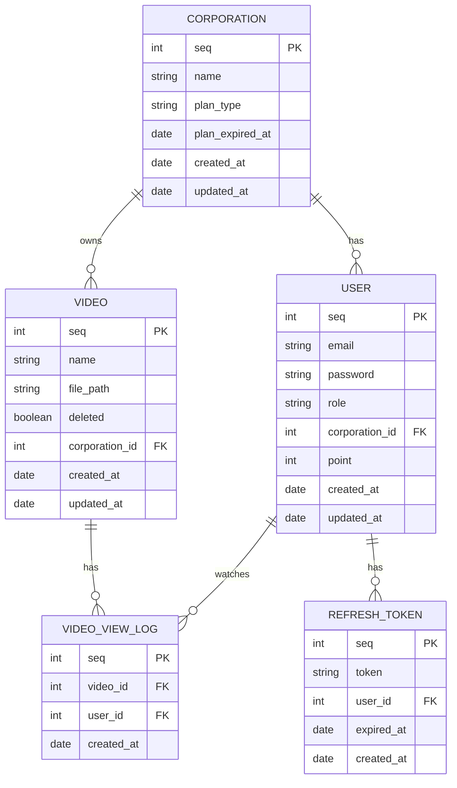
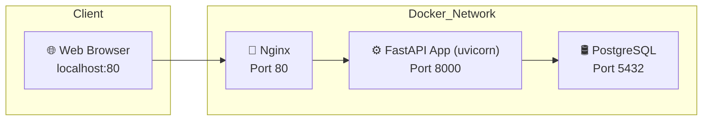

# 🚀 Video Management Server

FastAPI, SQLAlchemy, PostgreSQL 기반의 비동기 동영상 관리 서버입니다.

기업 · 유저 · 영상 CRUD, 인증, 스트리밍, 포인트 지급, Soft Delete, 유료 복구 기능을 포함합니다.

### 🔄 기능 체크리스트

| 기능 | 구현 여부 |
| --- | --- |
| 기업/유저/영상 CRUD | ✅ |
| 유료/무료 플랜 및 기한 관리 | ✅ |
| soft delete 및 복구 | ✅ |
| JWT 로그인(access + refresh) | ✅ |
| 포인트 지금 (영상 조회 시) | ✅ |
| 유료 플랜 기한 만료 시 자동 전환 | ✅ |
| Swagger 문서 | ✅ /docs |
| docker-compose | ✅ |
| Alembic 또는 SQL Schema 파일 | ✅ |
| .http 테스트 제공 | ✅ |

---

## ✅ 프로젝트 개요

- 기업, 유저, 영상 리소스를 비동기 API로 관리
- JWT 기반 인증 시스템 (access/refresh token)
- 영상 스트리밍 요청 시 유저에게 포인트 지금
- 유료 플랜 기업만 soft delete 된 영상 복구 가능
- Docker + Alembic 기반 인프라 및 마이그리션
- REST Client 기반 HTTP 테스트 스크립트 제공
- APScheduler를 이용해 유료 플랜 기한 초과 여부를 주기적으로 체크하여, 자동으로 무료 플랜으로 전환

---

## 🔐 접속 주소

- Base
    - [http://localhost](http://localhost/docs)
- Swagger
    - http://localhost/docs

---

## 🧱 기술 스택

| 항목 | 내용 |
| --- | --- |
| 언어 | Python 3.11 |
| 웹 프레임워크 | FastAPI (async) |
| ORM | SQLAlchemy (Async ORM) |
| DB | PostgreSQL 15 (Docker 기반) |
| 인증 | OAuth2PasswordBearer + JWT |
| Infra | Docker Compose |
| Migration | Alembic |
| 테스트 | `.http` (REST Client) |

---

## 📂 프로젝트 폴더 구조

```
📆 fastapi-lumanlab/
├── 🗂️ alembic/                              # DB 마이그레이션 (alembic revision 및 env.py)
│   ├── 📝 env.py
│   └── 📜 versions/
│       └── 🧾 de519d8b11a1_init_schema.py   # alembic 초기 DB 스키마 생성 리비전 파일
├── 🗂️ docker/                               # Docker 실행 스크립트
│   ├── 🖥️ start.sh                          # 컨테이너 실행용 셸 스크립트
├── 🗂️ nginx/                                # Nginx 설정
│   ├── ⚙️ nginx.conf                        # Nginx 설정 파일
├── 🗂️ rest_client/                          # REST Client 테스트 스크립트
│   ├── 📄 auth_test.http
│   ├── 📄 corporations_test.http
│   ├── 📄 tokens_test.http
│   ├── 📄 users_test.http
│   ├── 📄 videos_test.http
│   └── 📄 view_logs_test.http
├── 🗂️ src/                      # FastAPI 애플리케이션 소스
│   ├── ⚙️ config/               # 의존성 주입 config 구성
│   ├── 🧠 core/                 # 앱 팩토리, DB 설정, 환경 설정 등
│   ├── 🧩 domain/               # 도메인 객체 (DB 의존성 없는 순수 객체)
│   ├── 📨 dto/                  # 요청(Request) / 응답(Response) DTO
│   ├── 🏗️ entity/               # SQLAlchemy 모델
│   ├── 🏷️ enums/                # Enum 정의 (회원/기업 등)
│   ├── 📦 env/                  # .env.dev 환경파일
│   ├── 🚨 exception/            # 공통 예외 및 핸들러
│   ├── 🔁 mapper/               # ORM 모델 <-> 도메인 엔티티 변환
│   ├── 📂 repository/           # DB 접근 계층
│   ├── 🌐 routers/              # FastAPI 라우터 (API 엔드포인트)
│   ├── 🧩 service/              # 비즈니스 로직 계층
│   ├── 🧪 tests/                # 단순 테스트 코드
│   └── 🛠️ utils/                # JWT, 암호화 유틸
├── ⚙️ alembic.ini               # Alembic 마이그레이션 설정 파일
├── 🐘 docker-compose.yml        # PostgreSQL 인프라 구성
├── 🐳 Dockerfile                # 애플리케이션용 Docker 빌드 설정
├── 🧾 init_schema.sql           # DB 수동 초기화 SQL
├── 🚀 main.py                   # FastAPI 앱 실행 진입점
├── 📘 README.md                 # 프로젝트 전체 개요 및 설명서
├── 📙 README_API_DESC.md        # API 명세 및 설명 문서
├── 📗 README_TEST.md            # REST API 테스트 설명서
└── 📦 requirements.txt          # Python 의존성 정의
```

---

## 📂 ERD 아키텍처 (Mermaid)

▶ **Corporation**: 기업 정보 / 유료 여부 / 기한 관리  
▶ **User**: admin or guest / 기업 / 포인트  
▶ **Video**: 영상 메타정보 / 삭제 여부  
▶ **VideoViewLog**: 유저의 영상 시청 로그  
▶ **RefreshToken**: 리프레시 토큰 관리  



## 🗺️ 서비스 아키텍처 (Mermaid)



---

## 🚀 실행 방법

### ✅ 전체 컨테이너 실행 및 종료 (FastAPI + Nginx + PostgreSQL)

```bash
docker-compose up -d
docker-compose down
```

- `backend`: FastAPI 앱 (uvicorn 실행)
- `postgres`: PostgreSQL 15
- `nginx`: FastAPI → Nginx 프록시 구성 (80포트 노출)

```python
[+] Running 4/4
 ✔ Network fastapi-lumanlab_default  Created  0.0s 
 ✔ Container fastapi-postgres  Created  0.1s 
 ✔ Container fastapi-backend   Created  0.1s 
 ✔ Container fastapi-nginx     Created  0.1s     
```

---

## ✅ 옵션

- Alembic 마이그레이션
    
    ```bash
    docker exec -it fastapi-backend alembic upgrade head
    ```
    
- SQL 스크립트 수동 실행
    
    ```bash
    docker exec -it fastapi-postgres bash
    psql -U postgres -d lumanlab_db -f init_schema.sql
    ```
    
- 의존성 설치
    
    ```bash
    python3 -m venv venv
    source venv/bin/activate
    pip install -r requirements.txt
    ```
    
- Uvicorn 실행
    - 프로젝트 루트 디렉토리에서 실행
    
    ```bash
    uvicorn main:app --reload
    ```

---

## 🥮 API 테스트

- `rest_client/` 디렉터리 내 `.http` 파일들을 VSCode REST Client 바탕으로 다운로드 가능
- 파이참 실행 → Uvicorn 실행 → 재생 아이콘 통해 실행 가능

## 🔐 인증 방식

- `POST /v1/auth/login` 호출 및 access/refresh token 발급
- 이후 모든 API 요청에는 헤더를 포함:

```
Authorization: Bearer {access_token}
Authorization: Bearer {admin_access_token}
```

---

## 🎤 질문 1.

**"영상을 S3 URL로 전달 vs 직접 Response – 각각 어떤 장단점이 있다고 보시나요?"**

실제 이번 과제에서는 요구사항에 따라 **영상 파일을 직접 Response** 하는 방식으로 구현했습니다.  
구체적으로는 `/v1/videos/stream/{video_id}` API에서 `httpx.AsyncClient()`를 이용해  
외부 영상 URL로 요청하고, 그 응답을 FastAPI에서 **`StreamingResponse`로 중계하는 프록시 방식**을 사용했습니다.  

```python
response = await client.get(video.file_path, timeout=10.0)
return StreamingResponse(content=response.aiter_bytes(), media_type="video/mp4")
```

### 이 방식의 장점은:

- 클라이언트가 **절대 직접 S3를 접근하지 않기 때문에 보안상 안전**합니다.
- 조회와 동시에 **시청 로그 기록, 포인트 지급** 등 후처리 로직을 함께 처리할 수 있습니다.

### 단점은:

- 대용량 영상일 경우 FastAPI 서버 자체가 **IO 부하**를 받게 되고,
- 트래픽이 많아지면 **백엔드 서버에 병목**이 생길 수 있습니다.

반대로 **S3 Presigned URL 방식**을 쓰면:

- 영상 자체는 **S3가 직접 클라이언트에게 전송**하므로 서버 부하가 없습니다.
- 하지만 **포인트 지급이나 시청 기록을 서버가 통제할 수 없다는 문제**가 있습니다.

그래서 이번 과제처럼 "영상 요청 시 포인트 지급"이 핵심이라면
**서버를 통해 직접 Response하는 방식이 더 적합** 합니다.

---

## 🎤 질문 2.

**"포인트 지급 API에서 동시성 이슈를 어떻게 해결했는지, 그 이유는?"**

영상 스트리밍 API에서는 동시에 여러 요청이 발생할 수 있기 때문에,  
**같은 유저가 동일한 영상을 중복 요청할 경우 포인트가 이중 지급되거나, 시청 로그가 중복 삽입될 수 있는 문제가 발생할 수 있습니다.**  
이를 방지하기 위해 `/stream/{video_id}` 라우터에서는 다음과 같은 **DB 트랜잭션 기반 제약 방어** 방식을 사용했습니다:  

1. `video_view_log` 테이블에 대해 `(user_id, video_id)`에 **UNIQUE 제약 조건**을 추가합니다.
2. 시청 로그 생성 시 **중복 삽입이 발생하면 `IntegrityError` 예외가 발생**하도록 설계합니다.
3. 포인트 지급 로직은 **시청 로그 삽입이 성공한 경우에만 실행**되도록 `try/except` + `else` 구문으로 안전하게 분기합니다.

```
try:
    await video_view_log_service.create_log(db, current_user.id, video_id)
except IntegrityError:
    await db.rollback()  # 중복 시청 → 무시
else:
    await user_service.add_point(db, current_user.id, 10)
```

이 구조를 통해,

- 🔒 **시청 로그가 1회만 생성되도록 보장**하고
- 💰 **포인트도 1회만 지급**되도록 제어할 수 있으며
- ⚙️ **DB가 동시성 충돌을 방어해주는 역할**을 수행합니다.

또한 SQLAlchemy의 **비동기 세션**은 이벤트 루프 기반으로 작동하지만,  
**트랜잭션 단위의 원자성은 그대로 유지**되기 때문에,  
일반적인 수준의 동시 요청에서는 안정적으로 동작합니다.  

💡 트래픽이 큰 환경에서는 Redis 분산 락, Row-Level Lock, 비동기 메시지 큐 등 추가적인 대안도 고려할 수 있습니다.